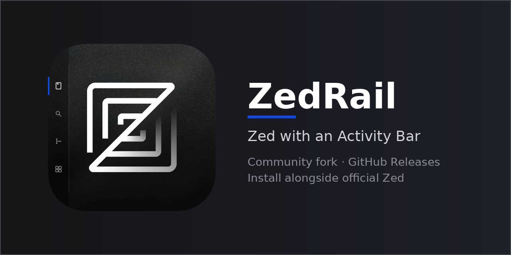

<p align="center">
  
</p>

<p align="center">
  <a href="https://qu3ntins.github.io/zedrail-website/"><strong>Website</strong></a>
  ·
  <a href="https://github.com/Qu3ntinS/zed-rail/releases"><strong>Download</strong></a>
  ·
  <a href="https://qu3ntins.github.io/zedrail-website/docs/"><strong>Docs</strong></a>
</p>

# ZedRail

**Zed with an Activity Bar** — a community fork of [Zed](https://github.com/zed-industries/zed).

> Not affiliated with Zed Industries. Zed Cloud services (Collab, AI, accounts) are provided by [zed.dev](https://zed.dev).

ZedRail adds an optional VS Code-style vertical activity bar for panel buttons, while tracking upstream Zed stable releases.

## Features

- **Activity Bar** — vertical panel rail (disabled by default; enable in settings)
- **Upstream sync** — rebased on Zed stable releases
- **Auto-update** — via GitHub Releases
- **Side-by-side install** — separate config directory (`~/.config/zedrail/`)

## Download

### Linux (one-liner)

```sh
curl -f https://raw.githubusercontent.com/Qu3ntinS/zed-rail/zedrail/script/install-zedrail.sh | sh
```

Or download manually from [GitHub Releases](https://github.com/Qu3ntinS/zed-rail/releases):

| Platform | Asset |
|----------|-------|
| Linux x86_64 | `zedrail-linux-x86_64.tar.gz` |
| Linux aarch64 | `zedrail-linux-aarch64.tar.gz` |
| Windows x86_64 | `ZedRail-x86_64.exe` |
| macOS (unsigned) | `ZedRail-aarch64.dmg` |

### Linux install

Extract the tarball to `~/.local`:

```sh
tar -xzf zedrail-linux-x86_64.tar.gz -C ~/.local
```

Run via `~/.local/zedrail.app/bin/zedrail` or the `.desktop` entry.

### macOS (unsigned)

macOS builds are unsigned in v1. After opening the DMG, run:

```sh
xattr -cr /Applications/ZedRail.app
```

Then open ZedRail via right-click → Open.

## Enable the Activity Bar

Open the Settings Editor and search for `activity_bar`, or add to `~/.config/zedrail/settings.json`:

```json
{
  "activity_bar": {
    "enabled": true
  }
}
```

See [docs/FORK.md](docs/FORK.md) for all activity bar settings.

## Building from source

See upstream Zed development docs:

- [Linux](docs/src/development/linux.md)
- [macOS](docs/src/development/macos.md)
- [Windows](docs/src/development/windows.md)

```sh
cargo run -p zed
```

## Contributing

ZedRail-specific changes (activity bar, fork branding, release infra) belong here. Fixes that benefit all Zed users should go to [zed-industries/zed](https://github.com/zed-industries/zed).

See [CONTRIBUTING.md](CONTRIBUTING.md) and [docs/FORK.md](docs/FORK.md).

## Licensing

Same as upstream Zed: primarily GPL-3.0-or-later, with Apache-2.0 components where marked.
